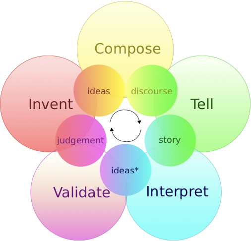

`
$$ \begin{align} 32 & \\ +~ 94 & \\ \hline 126 & \end{align} $$
`

...

<!-- .slide: data-background="foxcrow.jpg" -->

La zorra y el cuervo

...

¿Qué hicieron ayer?

...

<!-- .slide: data-background="date.jpg" -->

La historia de aquella primera cita

...

<!-- .slide: data-background="tortilla.jpg" -->

- Pelar y cortar las papas
- Freir papas en aceite de oliva
- Batir los huevos
- Escurrir las papas
- Mezclar con el huevo
- Cuajar en la sartén por ambos lados

|||
<!-- las conclusiones -->

# ¿Qué tienen todas estas cosas en común?

notes: son historias

...

# Todas las sociedades usan narrativa
...

# Muchos recuerdos son narrativas

notes: memoria episódica, el caso del pintor

...

# Muchas de las cosas que sabemos hacer son narrativas

notes: schank y abelson

...

# ¿Por qué?

notes: porque es el lenguaje de la mente, y lo voy a probar

|||

# La narrativa es **fundamental** para la IA

notes: MI historia

...

# La IA necesita múltiples disciplinas para ser narrativa

- Computación <!-- .element: class="fragment" data-fragment-index="1" -->
- Narratología <!-- .element: class="fragment" data-fragment-index="2" -->
- Creatividad <!-- .element: class="fragment" data-fragment-index="3" -->

...

# La computación "sólo" es el lenguaje

Hace falta saber **qué** queremos transmitir

...

# Las estructuras narratológicas no son completas

Propp, Barthes, Genette... no resolvieron todo el problema

...

# La creatividad es...

¿qué es la creatividad? <!-- .element: class="fragment" data-fragment-index="1" -->

...

# Nada tenía la respuesta

Así que empezamos a trabajar para encontrarla

|||

# La máquina que sabe contar cuentos

La historia que aún estamos escribiendo

...

Comenzamos escribiendo algoritmos que encadenaban eventos

...

Juan fue a la ciudad  
Juan conoció a María  
Juan se enamoró  
María se enamoró  
Juan y María se casaron

...

Pronto nos dimos cuenta de que incluir información era un problema

...

Juan fue a la ciudad  
Juan tuvo un accidente y **murió**  
Juan se enamoró  
María se enamoró  
Juan y María se casaron

...

Aunque podíamos solucionarlo, la IA clásica **no era suficiente**

Una narrativa no es sólo una sucesión de eventos

...

# Así que seguimos intentándolo

...

- TaleSpin
- Minstrel
- MEXICA
- Brutus
- Façade
- Fabulist

...

<!-- .slide: data-background="stella.png" -->

# stella

...

<!-- .slide: data-background="beyondthefence.png" -->

# Beyond the Fence

notes:

**y hasta esto!** fin sección

...

<https://www.youtube.com/watch?v=VZzI4sfCFjc>

|||

# Pero necesitábamos más conocimento, más *multidisciplinaridad*

...

# El lector

¿Por qué funcionan tan bien las narrativas?

...

Comenzamos a pensar en la narrativa como **comunicación**

El lector es tan importante como el escritor

...

# El lector *también es creativo*

Casi toda la historia ocurre en la mente del lector <!-- .element: class="fragment" data-fragment-index="1" -->

|||

|||

# La narrativa es parte de nuestra cognición

La narratología moderna (Bruner, Herman, Szilas) propone ver la narrativa como un fenómeno de la **mente**

...

# La hipótesis narrativa

> La narrativa no es una mera forma literaria, sino un conjunto de estructuras cognitivas fundamentales

...

# ¿Por qué?

...

# Nuestra evolución

- Espacio <!-- .element: class="fragment" data-fragment-index="1" -->
- Tiempo <!-- .element: class="fragment" data-fragment-index="2" -->
- Interacción <!-- .element: class="fragment" data-fragment-index="3" -->

...

# Tiempo

...

# Espacio y lugares

...

# Agentes

...

# Causalidad

...

|||

# De la hipótesis a la teoría

Experimentos

notes: hemos empezado a investigar

...

<!-- .slide: data-background="experiment.jpg" -->

# Componentes principales de una historia

<!--  -->

...

<!-- .slide: data-background="distance.png" -->

# Historias como re-representación de la realidad

<!--  -->

...

<!-- .slide: data-background="decorative.png" -->

# Impacto de los elementos decorativos

<!--  -->

...

<!-- .slide: data-background="suspense.png" -->

# Información, suspense y diversión

...

<!-- .slide: data-background="cables.jpg" -->

# Reacciones físicas del lector

|||

# Y, después de todo, ¿qué hemos aprendido?

...

## La narrativa ocurre de forma constante y natural en las personas

...

## Las estructuras narratológicas describen mucho

(pero no todo)

...

## Es necesario modelar al lector

...

## La creatividad es crucial en el fenómeno narrativo

|||

# Crear una IA narrativa requiere

- Computación
- Narratología
- Psicología
- Ciencias cognitivas
- Creatividad Computacional

...

# Es necesario un enfoque multidisciplinar