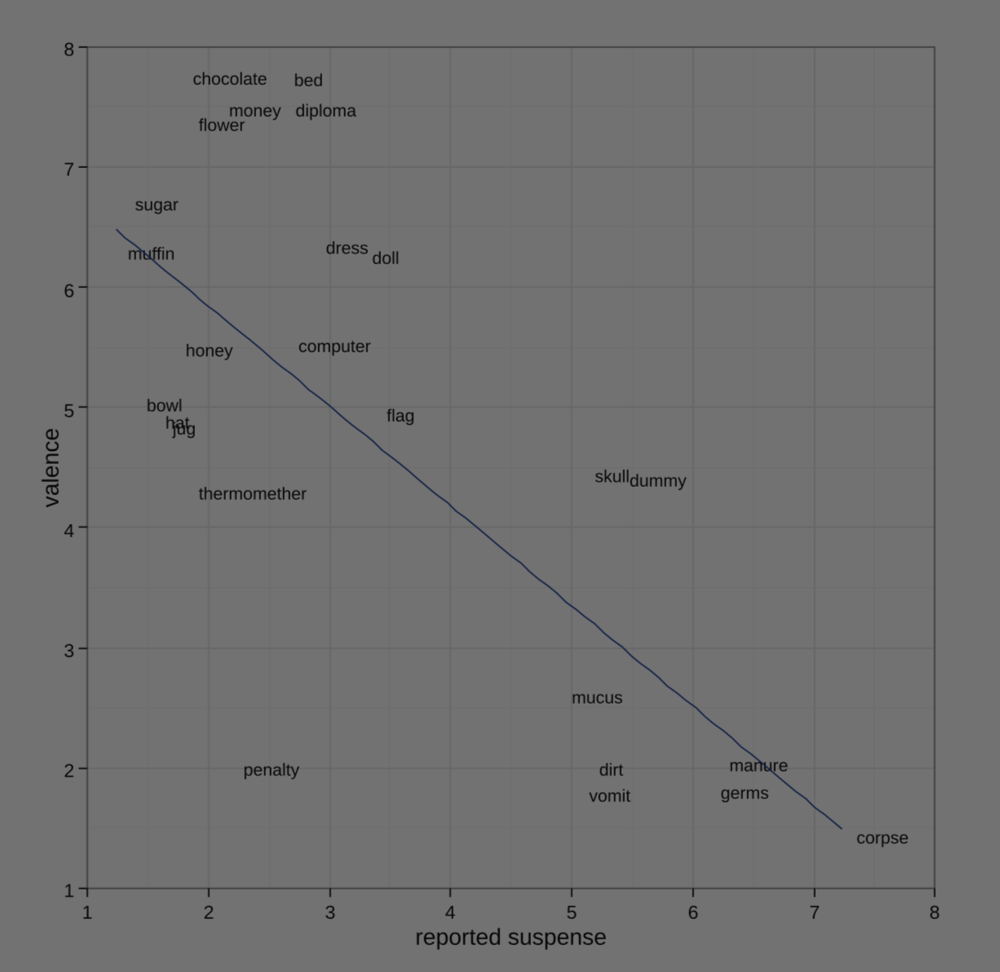

<!-- Intro: ejemplos -->
```
  32
+ 94
----
 126
```

<!-- TODO: ¿qué tal el $$\LaTeX$$ ? -->

...

<!-- TODO: la Biblia (no, otra cosa... Esopo!) -->

El cuervo y la zorra

...

¿Qué hicieron ayer?

...

TODO: imagen de una cita

...

- Pelar y cortar las papas
- Freir papas en aceite de oliva
- Batir los huevos
- Escurrir las papas
- Mezclar con el huevo
- Cuajar en la sartén por ambos lados

|||
<!-- las conclusiones -->

# ¿Qué tienen todas estas cosas en común?

notes: son historias

...

# Todas las sociedades usan narrativa

...

TODO: decir cuándo empiezan a contar historias los niños

...

# Muchos recuerdos son narrativas

notes: memoria episódica, el caso del pintor

...

# Muchas de las cosas que sabemos hacer son narrativas

notes: schank y abelson

...

# ¿Por qué?

notes: porque es el lenguaje de la mente, y lo voy a probar

|||

# Volvamos al principio...

notes: MI historia

...

# ¿Qué necesita una *inteligencia artificial para contar un cuento?

- Computación <!-- .element: class="fragment" data-fragment-index="3" -->
- Narratología <!-- .element: class="fragment" data-fragment-index="1" -->
- Creatividad <!-- .element: class="fragment" data-fragment-index="2" -->

...

# La computación "sólo" es el lenguaje

Hace falta saber **qué** queremos transmitir

...

# Las estructuras que definen la narrativa

Propp, Barthes, Genette...

¡Hay muchos fenómenos que **no son capaces de describir**! <!-- .element: class="fragment" data-fragment-index="1" -->

...

# La creatividad es...

... ¿qué es la creatividad? <!-- .element: class="fragment" data-fragment-index="1" -->

...

# Nada tenía la respuesta

Así que empezamos a trabajar para encontrarla

|||

# La construcción del generador de historias

Una historia que aún no ha terminado

...

Comenzamos escribiendo algoritmos que encadenaban eventos

...

```
Juan fue a la ciudad
Juan conoció a María
Juan se enamoró
María se enamoró
Juan y María se casaron
```

...

Pronto nos dimos cuenta de que incluir información era un problema

...

```
Juan fue a la ciudad
Juan tuvo un accidente y murió
Juan se enamoró
María se enamoró
Juan y María se casaron
```

(Hemos a Juan en un muerto viviente) <!-- .element: class="fragment" data-fragment-index="1" -->

...

Aunque podíamos solucionarlo, la IA clásica **no era suficiente**

Una narrativa no es sólo una sucesión de eventos

...

# Así que seguimos intentándolo

...

- TaleSpin
- Minstrel
- MEXICA
- Brutus
- Façade
- Fabulist


...

TODO: stella

...

<!-- .slide: data-background="beyondthefence.png" -->

notes:

**y hasta esto!** fin sección

|||

# El lector

¿Por qué funcionan tan bien las narrativas?

...

Comenzamos a pensar en la narrativa como **comunicación**

El lector es tan importante como el escritor

...

El lector *también es creativo*

Casi toda la historia ocurre en la mente del lector <!-- .element: class="fragment" data-fragment-index="1" -->

|||

TODO: foto de ICTIVS

|||

# La narrativa es parte de nuestra cognición

La narratología moderna (Bruner, Herman, Szilas) propone ver la narrativa como un fenómeno de la **mente**

...

# La hipótesis narrativa

> La narrativa no es una mera forma literaria, sino un conjunto de estructuras cognitivas fundamentales


...

# ¿Por qué?

...

# Nuestra evolución

- Espacio <!-- .element: class="fragment" data-fragment-index="1" -->
- Tiempo <!-- .element: class="fragment" data-fragment-index="2" -->
- Interacción <!-- .element: class="fragment" data-fragment-index="3" -->

...

# Tiempo

...

# Espacio y lugares

...

# Agentes

...

# Causalidad

...


...


|||

# De la hipótesis a la teoría

Experimentos

notes: hemos empezado a investigar

...

# Componentes principales de una historia


...

# Historias como re-representación de la realidad


...

# Impacto de los elementos decorativos



...

# Reacciones físicas del lector


||| 

# La generación por ordenador necesita tener en cuenta la mente humana

...

Es importante saber qué sabe y recuerda el lector

...

Necesitamos saber qué establece el *principio* y el *final* de una historia

...

La respuesta emocional es crucial

...

Estudiar a las personas puede ser la clave

...

# No sólo la narrativa necesita cognición

Todas las ramas de la creatividad computacional necesitan tenerla en cuenta